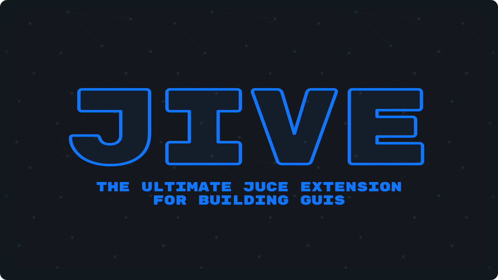

<p align="center">
  
</p>

<p align="center">
  
  
  
  
</p>

<p align="center">
  
  
</p>

<p align="center">
  
  
  
</p>

- [About](#about)
    - [Improved Developer Experience](#improved-developer-experience)
    - [Improved Architecture](#improved-architecture)
- [Approach](#approach)
    - [Layouts](#layouts)
    - [Style Sheets](#style-sheets)
- [Integration](#integration)
    - [CMake](#cmake)
    - [Projucer](#projucer)
- [Getting Started](#getting-started)
- [Contributing](#contributing)

## About

JIVE is a bundle of [JUCE](https://github.com/juce-framework/JUCE) modules centered around the desire to have a more modern approach to UI development.

This approach is inspired by web front-ends where we write declarative markup (HTML) to define what components we have, style those components using style sheets (CSS), and then dynamically update those components at runtime using imperitive code (JavaScript). With JIVE however, all three of these layers are done using tools already available in JUCE - [`juce::ValueTree`](https://docs.juce.com/master/classValueTree.html) for markup, [`juce::var`](https://docs.juce.com/master/classvar.html)/[`juce::DynamicObject`](https://docs.juce.com/master/classDynamicObject.html) for style sheets, and regular old C++ for dynamically updating.

### Improved Developer Experience

- Write less UI code than in a typical JUCE project.
- Write _better_ UI code that's more declarative and uses common terminology with other UI frameworks.
- Build ideas faster, with much shorter iterations between one design to another.
- No additional dependencies - built purely from the tools provided by JUCE.
- Less boilerplate and therefore less time wasted (and maybe even fewer bugs) when developing UI features.
- Easier onboarding for any team members unfamiliar with the querks and complexities of developing GUIs in JUCE.

### Improved Architecture

- Encourages the separation of the UI from the business logic that controls it.
- Encapsulates the JUCE backend enabling applications to interact with the UI through common data structures like value-trees and JSON documents.
- Specifically built to fit the [Model-view-presenter](https://en.wikipedia.org/wiki/Model%E2%80%93view%E2%80%93presenter) pattern - although flexible enough to suit any architecture.
- Inspired by front-end web libraries to more easily build design systems and share components.

## Approach

There are two main constituents to JIVE - [`jive_layouts`](jive_layouts/) and [`jive_style_sheets`](jive_style_sheets/). When used together, these modules completely overhaul the experience of building GUIs in JUCE by removing the boilerplate involved in writing [`Component`](https://docs.juce.com/master/classComponent.html) classes.

### Layouts

`jive_layouts` addresses the hierarchy and layout of GUIs by allowing developers to describe their UI using value-trees.

Unlike in a typical JUCE application where most of your UI code is spent describing _how_ components are shown on the screen, JIVE's approach is inspired by HTML where we simply describe _what_ is on the screen.

<details>
<summary>Example</summary>

Example XML file that could be parsed to a `juce::ValueTree`

_Note that `juce::ValueTree` doesn't support inline text elements so these will need to be converted to `text` properties before parsing to a `juce::ValueTree`._

```xml
<Window width="640" height="400" align-items="centre">
    <Component id="header" align-items="centre">
        <Text id="title">Welcome to JIVE!</Text>
        <Text id="subtitle">The ultimate JUCE extension for building GUIs.</Text>
    </Component>

    <Component id="nav" display="grid" template-columns="1fr 1fr 1fr" template-rows="1fr">
        <Button>
            <Text>Home</Text>
        </Button>

        <Button>
            <Text>About</Text>
        </Button>

        <Button>
            <Text>Contact</Text>
        </Button>
    </Component>
</Window>
```
</details>

### Style Sheets

`jive_style_sheets` addresses the styling of GUIs by allowing developers to apply common style properties using JSON documents.

Inspired by CSS, JIVE's style sheets allow common styling properties like background colours, text colours, and font size to be set on any UI element, removing the need to use [`juce::Graphics`](https://docs.juce.com/master/classGraphics.html) for the majority of components.

<details>
<summary>Example</summary>

Example JSON document that could be parsed to a `jive::Object` and set as the top-level window's `style` property.

```json
{
    "background": "#202020",
    "foreground": "#EEEEEE",
    "font-family": "Helvetica",

    "#title": {
        "font-size": "45",
        "font-style": "bold",
    },
    "#subtitle": {
        "font-size": "25",
        "font-style": "italic",
    },

    "Button": {
        "background": "#303030",
        "border": "#FF3077",
    },
}
```
</details>

## Integration

The simplest way to intergrate JIVE with your JUCE project is with [CPM](https://github.com/cpm-cmake/CPM.cmake):

```cmake
CPMAddPackage("gh:ImJimmi/JIVE@main")
```

If not using CPM, you should add JIVE as a submodule to your git repository:

```bash
git submodule add git@github.com:ImJimmi/JIVE.git
```

Or simply clone JIVE to use across multiple projects:

```bash
git clone git@github.com:ImJimmi/JIVE.git
```

### CMake


```cmake
add_subdirectory(path/to/JUCE)

# Recommended
CPMAddPackage("gh:ImJimmi/JIVE@main")

# If not using CPM
add_subdirectory(path/to/JIVE)

target_link_libraries(my_juce_project
PRIVATE
    jive::jive_layouts
    jive::jive_style_sheets
)
```

### Projucer

![Projucer](https://img.shields.io/static/v1?logo=data:image/png;base64,iVBORw0KGgoAAAANSUhEUgAAABwAAAAcCAYAAAByDd+UAAAACXBIWXMAABYlAAAWJQFJUiTwAAAJLklEQVRIiYWXeXRU1R3HP+/NnkyWmUlCyEoWwhK2oICsYS1EKVBFliKKgFtrPXqqlVq1xbprq7VHAalG69IiKkIVCFsUZAk5kBAggaxk3zOZmcz6Zt7tHwOBWk/7O+e+d8697/w+5937W75XEkLlmgkECEACCXlwvslx5pY6+4lb2wcqJ3Z76rNc/i4bCMz6+L74iKz6RPOos1mWqfuHxU7+/rovFSFAkkBCGvQl/RhQksKwC117f36q9aOHKzq/njoQGCDBNpS0xHFYIlORJAm7u4XGtnN097URoYtg7JBbS6ck3/XO+CFLPwBQhfr/gOFFj2JP2XVp09+KG95daNDquTlpJXnpS0jU5xJokJB9ehAgTAEM2TKtAxWcb91LaccO3H4P+enrvr195MsbogxD6sNe+XEgSHQMXJq57czKr2v6KqLXjlvHwqzHgVzUVjjy/Df0NLcRDPrDO4GG9IkjmPHsXDBBK70c6XqVAydeJTMmx7fxph3LUqMnFN0IlW+EdXlqpv7p5PyjXe6K6FfmbyczppBtJ7IRQMeFCs4cKIYoBa1FRmuTwaxQcehbelxuuNJM0hM7WNv9G36x7BBdoUbjmyfm7m8fqJzDDVsqCxGG+YIu25bS5d96lFbeXLSPZvtGbtpSwoOFe9hwsJakhWMYMS0bv8uHpJGQJAnFp5A8MxdLQiSOXz9N0+ub6V22iqkHRvHI/DLcWjfvnF5yZCDQkwoSQoAsSWH67stP767urdBvnlNIWesipm4pRq9xkp2bSOHhaqqQKdg4C1eXE0kKA729A6TdNhlNRxMDZZcwzcvHHw0da25l1KFY7pt/kCvOOr6sevJrAEm6Gvt19hNLi+remr5+4nrcvnUsKCzBag6SaDahkyQkjcwrB2sx5I8mMSsev9OLGlLRRegZNiMDcegYwh9ACIHGakFNS6DnwTXcVDGOglnPcvjK++Oq+4pXDZ7h0cZtL5m0GuYN28xzxW6cva0kR0cQUgWqEGTaIvj0WB31wLwVk3B2OvH0uUnOH4PFAP1fHkSTEA9CgCrQ2qy46srhXwdZbH2aaEMERxr++hqA3OmunnC244tRU1LuBlIoyAoiR0Vyvt1Jk8OHEhKYtDKKEmJraRuWReOJsplxd9jJXjEL6ioZKDmHbIsFINTaQeDCJaJW3QUP3Uk0OmamrKe8fXdKs7M8X67uLV5h97qZlnwnAMvHG3E8uZCiVdNZPiIZhy/IhQ4XkSYdn3xXg8dkIG/yMEI6AxmjYvB9+CWSRkPoSjPB+kb0kyYR9/HfifvHWyi+78AzwPiMe/AHVap7i+/ULNiQ9qQSbMpanPN77quq5/7Tu+gxuMhLN7FxQiobcrPIiY2h2enhclkLUpqNlWOHEpGXTZK/jdbVD6NNSca0sIDYPzxL1CMrkRPace9/Dm/R6xjtnehHLuJc/z70aIPSG6cW1KYb9VmJKW8z7VgR4AHFD0BirJX1mTmsSxtJhjSEz0o7cMsB7puSBoD/+xK8RSVE3b8OTaqGYPdJfN//k+CVctBHIkfGoXc70Cx5iW2ed/H1XW7Uuvyd1gTLdBwhGaQQOkMEOqOZEIIOn58Xz57ixYpSxlgsvH3LfGYZ0weT2DBjCoYZw/Gd3Y77u5OEuuqRTRZkW0b4A1UlJAkMwRBRhiH0Bk7GyOJae7hWDUS4iGskCUmjA1kDSojqfoXLfVZ+aEptNZ79Wwm2nEcyxiCZYq/6Ef/xlpAQCLTRhgR7t7fZYrMGQWMgSBBFDYG7H7RGlqZPZmP6JAriDLid++hwWkmMnhr+AdclNPEmLI9fRGk4TaDqK4ItJQjFg2yyIBnMaFSVoFbG5e0kUm91yQmRwxsu2ssZEymRaE5CdDZAwM/dw+dSvuBRvrp5AguN+zhecy/vlS3D7vdB4BiB4DFEfycD+6cTqHkBbWoM5iUvELV6B6aZv0W25hDqrcOQOh1/wjDauk8QH5HZqk2OGnumqHbrvKC/jt0T89kTa2L18HxyI3vp7tnKnvo9dHsbkNCQEb+CEfFzcDcn4ZNlbCktaONmo1wuRKn/DI0tD11qAYZxMzHkLSHU3YAUl0W77xzt3ReZPfTecjnHNvtzs8HIvqYdTI428fyEfJICH7Gz7Hb21P0FT8iHLWIUQihkxt+PTAsDnnZCA62EpE6MGY+BLCObs1CdDfjK/ojn4FJ8p9aijY8BrZaKxk/QaSHHlv+5PNQ8unRi4s9qTjYXEhQqDs95Pjj3AKqkwxoxEr3GTFD1YtTFkWnNR3W8Ew4sAV7Xm8hp85CMiRB0I+ljkc3ZSBEpBBp3QdWnOAlxtKWQ8Yk/7UiPufmwDDAr/YHfeYMKey7/HrMhlcToPFRVGYxET6CbZMtizFpw2rej0WnR6Ix4u95AaMGQ9iCquxEkGSQJEXBgjBkDGXext/5V7N5+Zg97eNNg8R5uzd+5IPOBs19UPk9V31mWj92JV+nCp/QiSzqUkIu0uJUQPIXf14MkxyDJ0agBP17vn9FmrUPSmkBVEIoD2d2IYdoOykUreyueYnb6mprRcT/58GoDDufJspEvLc6yjlC3lBbQ6XOyJu8AEirtzhI0mliGRmYScnxAuH3KgIpGb8TT/gzCEMSQvYlg+0F0ihvTnENcjtCy/fhsUqLSuGP0awXhlBRhZSWEihCCNtfFuY8VWcRD3+hFZc9REVB6xMmGZ0Vt7xEhhF901yC6axA99dbB0VaBcDteFkIIIRp2COFqEqcdp8Qv90eLX+01iSZH2W1CCIRQUYXKVdh1aIvz/IJniocH1u5C7KzcJPq8HeKahbrvFo4ahL02PBx1GuFvHi2EWiuEEKJNBMQnNZvFPbsQTx1OFw3200vDMDHI+IFMDCtIp78z54uqJ9472vTRjFh9LJNSVpMbX0BK9ARMoUvoJC8goQgdHimJdk8/lZ07OdX6Mf2+fqalrihdPvr1DRZj6vnBennV/kuXhrFhMXeuc8/6483vP3qha+/YQEghPnIEQ2NmE21IAsAV6KDDWUKn6yw6WUNuwqKq6an3vpWXeMfW8JmpV1X8/xDC1543Sv06+4n5dfbjt7W7Kif0eOpT3UpfLECEzuqIixjWkmgeVZ5lmbZvuHXW/uu+1BuuDdeB/wY8E3EZBoAa3AAAAABJRU5ErkJggg==&label=&message=Projucer&style=for-the-badge&color=555555)

Add modules to the project by clicking the "+" icon in the "Modules" panel and choosing "Add a module from a specified folder...".

## Getting Started

See [Getting Started](./docs/Getting%20Started.md) for a detailed guide on getting started with JIVE once you have it integrated in your project.

## Contributing

All contributions are welcome!

Please see the [Contribution Guidelines](./CONTRIBUTING.md) before submitting a PR. Be sure to check the [Issues Tab](https://github.com/ImJimmi/JIVE/issues) to avoid duplicates and to contribute to any ongoing conversation.
