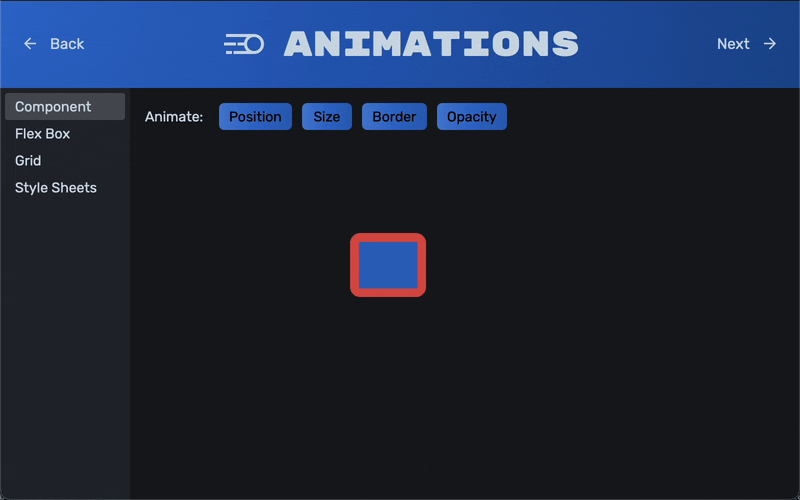

# Animations



JIVE offers a powerful animations API driven largely by its `Property` type, with lots of other utilities that make building dynamic, modern UIs a breeze.

JIVE borrows the [CSS `transition`](https://www.w3schools.com/css/css3_transitions.asp) syntax, and aims to support all the same properties as CSS transitions do.

## Animating a `jive::Property`

`jive::Property` is a powerful class that represents a property in a `juce::ValueTree`, or a `jive::Object` (derived from `juce::DynamicObject`). With the introduction of animations in JIVE 1.2, properties can now be animated by setting a `"transition"` property on the same source.

The `"transition"` properties use the same syntax as the `transition` property in CSS, and so can be defined by a string like so:

```cpp
juce::ValueTree state{
    "MyState",
    {
        { "value", 100 },
        { "transition", "value 500ms ease-in" },
    },
};
```

Here, we've specified a transition for the `"value"` property, saying that when changed, it should transition to its new value over 500ms, using an ease-in curve.

Multiple transitions can be specified using a comma-separated list:

```cpp
juce::ValueTree state{
    "MyState",
    {
        { "value", 100 },
        { "alpha", 0.3 },
        { "transition", "value 500ms ease-in, alpha 4s 1s" },
    },
};
```

This time, we've specified an additional transition for the `"alpha"` property, which has a delay of 1s, followed by a duration of 4s.

If we now change the `"value"` property, we still get the same behaviour as we would _without_ a transition defined, however we can also querty the current state of its transition like so:

```cpp
juce::ValueTree state{
    "MyState",
    {
        { "value", 100 },
        { "transition", "value 500ms" },
    },
};
jive::Property<float> value{ state, "value" };
expect(value.get() == 100.0f);              // true
expect(value.calculateCurrent() == 100.0f); // true

value = 350.0f;
expect(value.get() == 350.0f);              // true - .get() returns the target
                                            // value, not the current
                                            // interpolated value
expect(value.calculateCurrent() == 100.0f); // true - no time has passed so the
                                            // current value is still 100

// Wait 250ms...
expect(value.get() == 350.0f);             // true
expect(value.calculateCurrent() == 225.0f) // true - half the animation duration
                                           // has passed, so the value is 50%
                                           // to its target
```

The `jive::Property::onValueChanged()` callback is invoked once when the target value changes. The `jive::Property::onTransitionProgressed()` callback is called repeatedly while a value is transitioning, so this would be a good place to call `calculateCurrent()`.

JIVE even supports more complex CSS transition definitions, like `cubic-bezier()`, allowing for highly customised transitions.

```cpp
juce::ValueTree state{
    "MyState",
    {
        { "value", 100 },
        { "transition", "value 1s cubic-bezier(0.17, 0.67, 0.83, 0.67)" },
    },
};
```

## Interpolation

`jive::Property::calculateCurrent()` will calculate the current interpolated value between the source value, and the target value. This calculation calls `jive::interpolate()` to interpolate between the given values.

Custom and/or non-numeric types can be interpolated by writing an implementation of `jive::Interpolate<>` for the given type. For example:

```cpp
namespace jive
{
    template <>
    struct Interpolate<MyCustomType>
    {
        MyCustomType operator()(const MyCustomType& start,
                                const MyCustomType& end,
                                double proportion) const
        {
            // ...
        }
    }
};

jive::Property<MyCustomType> property;
property.calculateCurrent(); // Calls jive::Interpolate<MyCustomType>
```

## Easing

As well as the built-in easing functions, named in accordance with the standard CSS easing functions, more complex transitions with custom easing functions can be defined by constructing a `jive::Transition` object. For example, a bouncing transition could be defined like so:

```cpp
jive::Transition transition;
transition.duration = juce::RelativeTime::seconds(1.5);
transition.timingFunction = [](double x) {
    // https://easings.net/#easeOutBounce
    static constexpr auto n1 = 7.5625;
    static constexpr auto d1 = 2.75;

    if (x < (1.0 / d1))
        return n1 * x * x;

    if (x < (2.0 / d1))
        return n1 * (x -= (1.5 / d1)) * x + 0.75;

    if (x < (2.5 / d1))
        return n1 * (x -= (2.25 / d1)) * x + 0.9375;

    return n1 * (x -= (2.625 / d1)) * x + 0.984375;
};

jive::Transitions::ReferenceCountedPointer transitions = new jive::Transitions{};
(*transition)["value"] = transition;

juce::ValueTree state{
    "State",
    {
        { "value", 123 },
        { "transition", transitions },
    },
}
```
