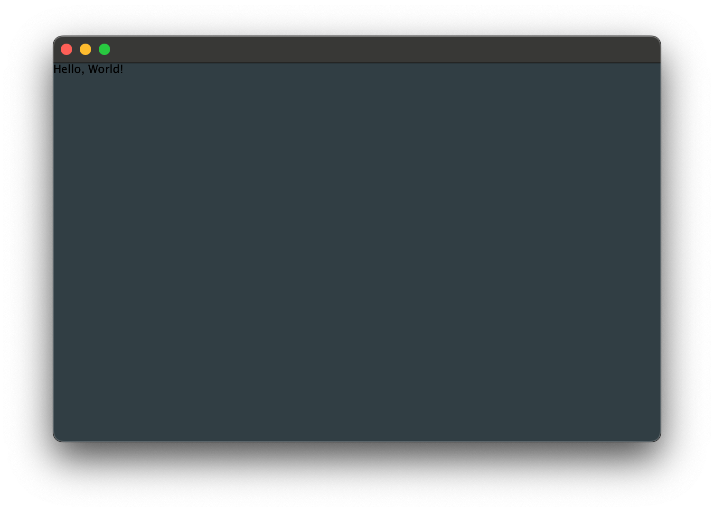
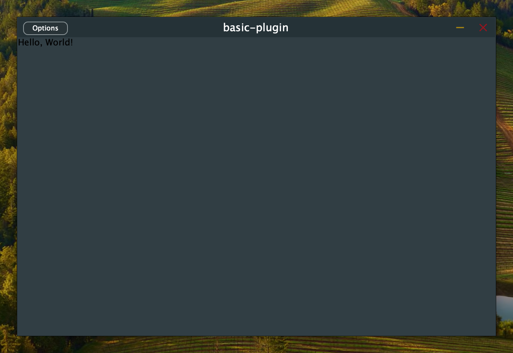
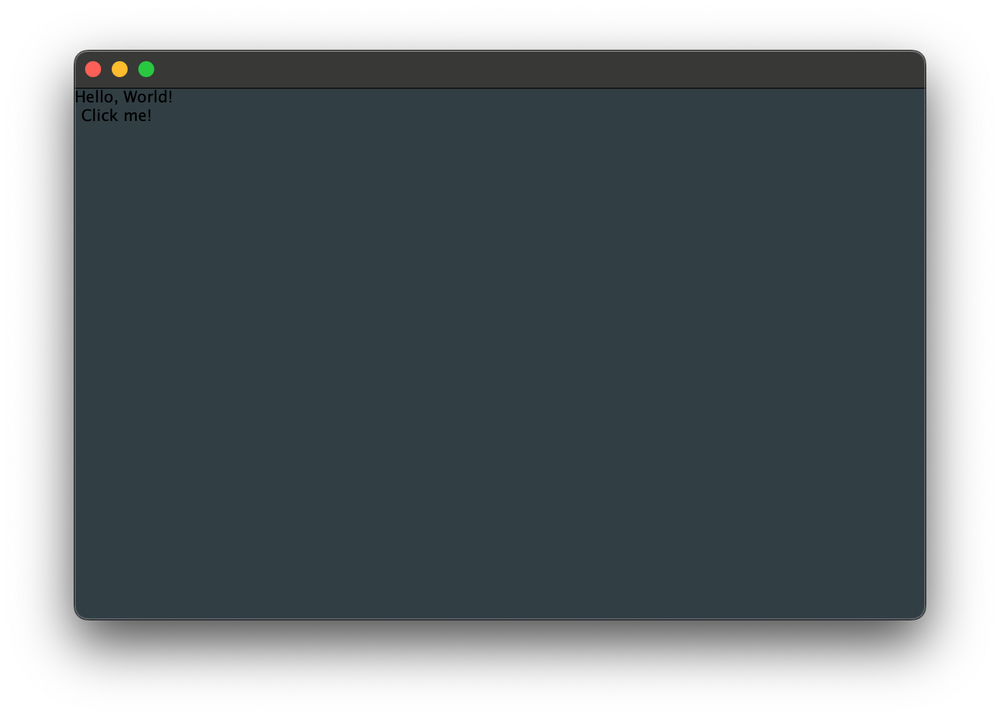
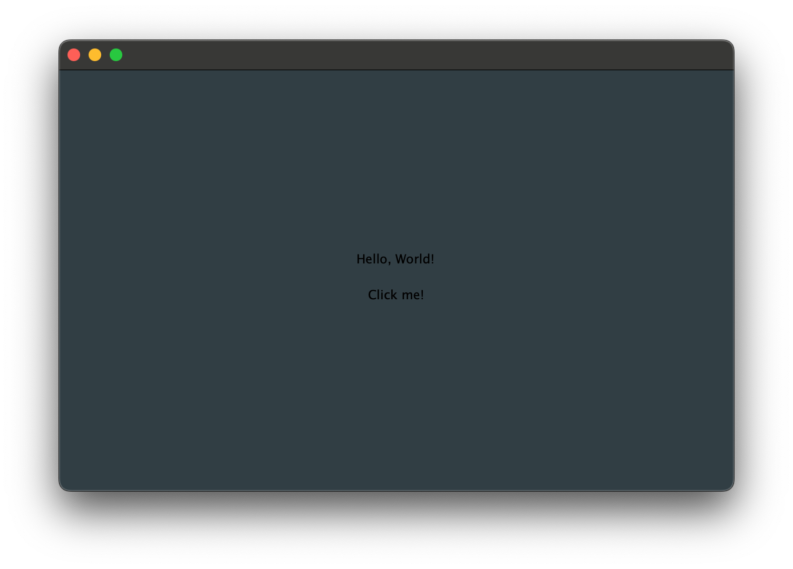
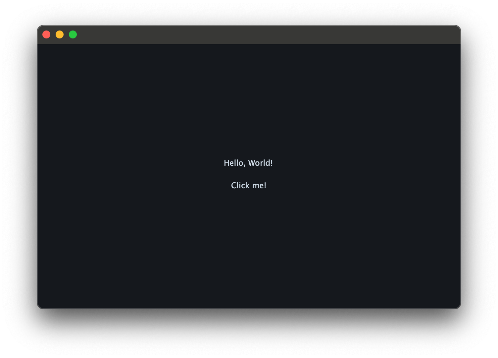
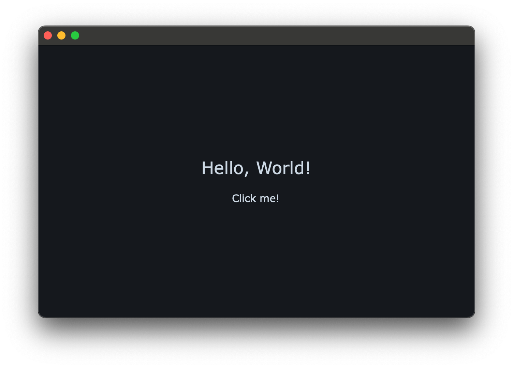
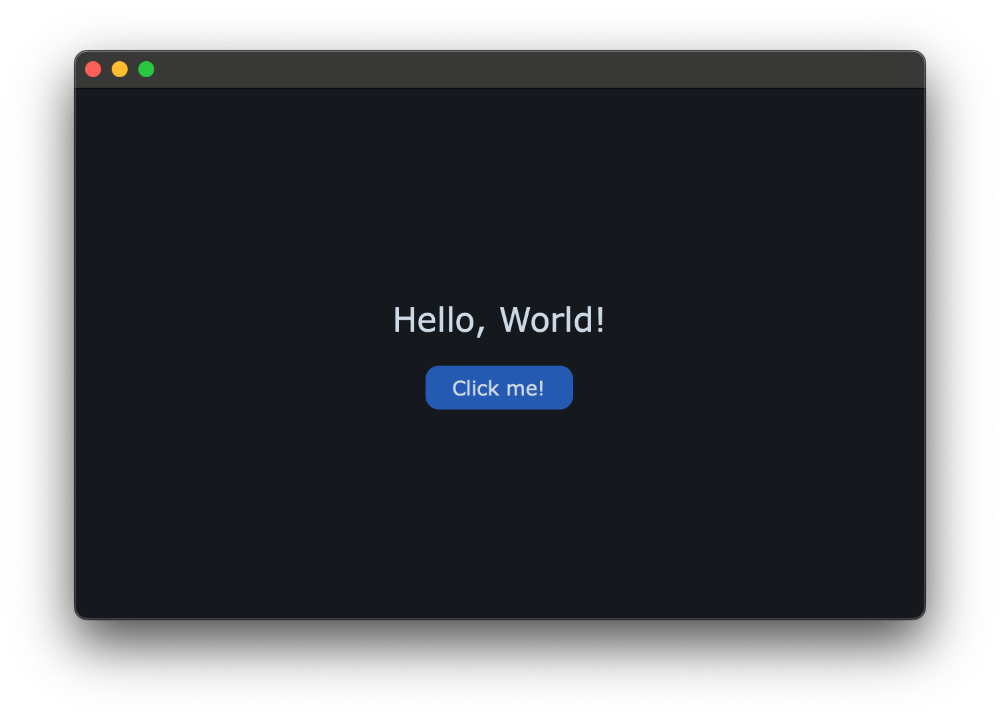

# Getting Started

- [Getting Started](#getting-started)
    - [The Basics](#the-basics)
        - [Building a `juce::ValueTree`](#building-a-jucevaluetree)
        - [Interpreting the view](#interpreting-the-view)
        - [Dynamic changes](#dynamic-changes)
    - [Styling](#styling)
        - [Custom layouts](#custom-layouts)
        - [Style Sheets](#style-sheets)
        - [Colors](#colors)
        - [Fonts](#fonts)
        - [Selectors](#selectors)
    - [Hooks](#hooks)
    - [Summary](#summary)

Once you have JIVE integrated with your project as shown in the [README](../README.md), you can get started writing code to create your first window with JIVE!

## The Basics

The basic workflow when building GUIs with JIVE is as follows:

- Describe your UI using a `juce::ValueTree`
- Use `jive::Interpreter` to interpret your `juce::ValueTree`, producing a `jive::GuiItem`
- Make changes to the `juce::ValueTree` to dynamically change the UI at runtime

### Building a `juce::ValueTree`

First, we need to build a `juce::ValueTree` to describe our UI. Let's write a function to encapsulate this:

```cpp
#include <juce_data_structures/juce_data_structures.h>

juce::ValueTree topLevel(const juce::String& greeting)
{
    return juce::ValueTree {
        "Window", // Change this to "Editor" for plugin projects
        {
            { "width", 640 },
            { "height", 400 },
        },
        {
            juce::ValueTree {
                "Text",
                {
                    { "text", greeting },
                },
            },
        },
    };
}
```

When the function is called, it will produce a `juce::ValueTree` describing a window of size 640x400 containing a text element with the given greeting text.

The `"Window"` type of the tree will mean the top-level component is a `juce::DocumentWindow` which will automatically be made visible and added to the desktop.

If you're writing a plugin project, you should change `"Window"` to `"Editor"` which will instead make the top-level component a `juce::AudioProcessorEditor` which can then be returned from `juce::AudioProcessor::createEditor()` (see below).

### Interpreting the view

Now that we have a `juce::ValueTree` describing our UI, we can use `jive::Interpreter` to build it for us.

This can be done in a `juce::JUCEApplication`'s `initialise()` method:

```cpp
#include <jive_layouts/jive_layouts.h>

class App : public juce::JUCEApplication
{
public:
    const juce::String getApplicationName() override { return ""; }
    const juce::String getApplicationVersion() override { return ""; }

    void initialise(const juce::String&) override
    {
        auto view = topLevel("Hello, World!");
        window = viewInterpreter.interpret(view);

        if (window != nullptr)
            viewInterpreter.listenTo(*window);
    }

    void shutdown() override
    {
        window = nullptr;
    }

private:
    jive::Interpreter viewInterpreter;
    std::unique_ptr<jive::GuiItem> window;
};

START_JUCE_APPLICATION(App)
```

If we run this, we'll get something like this:

<p align="center">
    
</p>

Instead of an application project, we could also make a plugin editor. Change the top-level view's type from `"Window"` to `"Editor"`, then write the `createEditor()` method like so:

```cpp
#include <jive_layouts/jive_layouts.h>
#include <juce_audio_processors/juce_audio_processors.h>

class PluginProcessor : public juce::AudioProcessor
{
public:
    // ...

    juce::AudioProcessorEditor* createEditor() override
    {
        auto view = topLevel("Hello, World!");

        // interpret() needs a juce::AudioProcessor* when interpreting "Editor"
        // types in order to construct the juce::AudioProcessorEditor
        if (auto editor = viewInterpreter.interpret(view, this))
        {
            // When interpreting an "Editor" type, the top-level item will be a
            // jive::GuiItem AND a juce::AudioProcessorEditor. So we can do a
            // dynamic-cast here to check that the editor was created successfully.
            if (dynamic_cast<juce::AudioProcessorEditor*>(editor.get()))
            {
                viewInterpreter.listenTo(*editor);

                // Release ownership to the caller.
                return dynamic_cast<juce::AudioProcessorEditor*>(editor.release());
            }
        }

        // Fallback in case the editor wasn't constructed for some reason
        return new juce::GenericAudioProcessorEditor{ *this };

        // If you're 100% sure your interpreted view is correct, you could just do:
        // return dynamic_cast<juce::AudioProcessorEditor*>(interpreter.interpret(view, this).release());
    }

private:
    jive::Interpreter viewInterpreter;
};

juce::AudioProcessor* createPluginFilter()
{
    return new PluginProcessor{};
}
```

Building this as a standalone app will look like this:

<p align="center">
    
</p>

### Dynamic changes

Now that we've created a window, we can still make changes to it by editing the `juce::ValueTree` it's referring to.

First, let's change our app to keep hold of the `juce::ValueTree` we're interpreting

```cpp
class App : public juce::JUCEApplication
{
public:
    // ...

    void initialise(const juce::String&) override
    {
        // ...
        view = topLevel("Hello, World!");
        // ...
    }

    // ...

private:
    // ...
    juce::ValueTree view;
};
```

Next, we can add a button to our UI _after_ it's already been built. Let's do that after a 2-second delay:

```cpp
    void initialise(const juce::String&) override
    {
        // ...

        // Append a button to our view after 2 seconds
        juce::Timer::callAfterDelay(2000, [this] {
            view.appendChild(juce::ValueTree{
                "Button",
                {},
                {
                    juce::ValueTree {
                        "Text",
                        {
                            { "text", "Click me!" },
                        },
                    },
                },
            });
        }, nullptr);
    }
```

You can do anything you like to the `juce::ValueTree` and the changes will be picked up and interpreted by `jive::Interpreter` and the `jive::GuiItem`s it produces.

## Styling

Currently, after the 2-second delay, our app looks like this:

<p align="center">
    
</p>

This isn't very exciting, so let's style it to look a little better.

### Custom layouts

First, let's change the layout so the items are centred. All containers in JIVE use a FlexBox layout by default using a `column` direction (meaning items are added from top-to-bottom). We can apply a few properties to our view to centre the items:

```cpp
juce::ValueTree topLevel(const juce::String &greeting) {
    return juce::ValueTree{
        "Window",
        {
            // ...
            { "justify-content", "centre" }, // Centre on the main-axis (vertically)
            { "align-items", "centre" },     // Centre on the cross-axis (horizontally)
        },
        // ...
    };
}
```

The text is also a little close to the button, so let's give it a margin:

```cpp
juce::ValueTree topLevel(const juce::String &greeting) {
    return juce::ValueTree{
        "Window",
        {
            // ...
        },
        {
            juce::ValueTree {
                "Text",
                {
                    // ...
                    { "margin", "0 0 20 0" }, // top, right, bottom, left - as in CSS
                },
            },
        }
    };
}
```

<p align="center">
    
</p>

The layout is much better but our app still looks a little dull. To do _graphical_ styling (colours, fonts, etc. as opposed to layouts/structural things) we should use `jive_style_sheets`.

### Style Sheets

### Colors

Now we can begin applying style sheets to our app. Let's start by changing the background and foreground colours:

```cpp
juce::ValueTree topLevel(const juce::String& greeting) {
    static constexpr auto style = [] {
        return new jive::Object{
            { "background", "#14181D" },
            { "foreground", "#CDD9E5" },
        };
    };

    return juce::ValueTree {
        "Window",
        {
            // ...
            { "style", style() },
        },
        // ...
    };
}
```

Here, we've added a lambda function that returns a `jive::Object` containing properties describing the background and foreground colours to use (n.b. returning a raw-pointer to a `jive::Object` like this is safe because it's a `juce::ReferenceCountedObject` and is being assigned to a `juce::var`. The object will be automatically deleted when it's no longer being used. You could explicitly wrap it in a `juce::var` and return that if you prefer to be extra safe). We've then called that lambda to assign those properties to the window's `style` property.

<p align="center">
    
</p>

### Fonts

Next, let's use some more interesting fonts. We'll use "Verdana" which [should be available on all systems](https://www.w3schools.com/cssref/css_websafe_fonts.php).

```cpp
juce::ValueTree topLevel(const juce::String& greeting) {
    static constexpr auto style = [] {
        return new jive::Object{
            // ...
            { "font-family", "Verdana" },
            { "font-size", 15 },
            {
                "#greeting",
                new jive::Object{
                    { "font-size", 25 },
                },
            }
        };
    };

    return juce::ValueTree{
        "Window",
        {
            // ...
        },
        {
            juce::ValueTree {
                "Text",
                {
                    { "id", "greeting" },
                    // ...
                },
            }.
        },
    };
}
```

Here, we've set the `font-family` and `font-size` properties on the top-level item's style sheet, which will be applied to all children of the window.

We've also added a `greeting` ID to the greeting text and set it to use a larger font size than everything else using the `#greeting` selector in the window's style sheet.

<p align="center">
    
</p>

### Selectors

Let's make that button look more like a button!

```cpp
juce::ValueTree topLevel(const juce::String& greeting) {
    static constexpr auto style = [] {
        return new jive::Object{
            // ...
            {
                "Button",
                new jive::Object{
                    {"background", "#255AB2"},
                    {"border-radius", 10},
                    {
                        "hover",
                        new jive::Object{
                            {"background", "#316DCA"},
                        },
                    },
                },
            }
        };
    };

    // ...
}

// ...


juce::Timer::callAfterDelay(2000, [this]() mutable {
    view.appendChild(
        juce::ValueTree{
            "Button",
            {
                { "padding", "7 20" },
            },
            {
                // ...
            },
        },
        nullptr);
});
```

Using the `"Button"` selector we can make all `<Button>` elements have a blue background and rounded corners. The nested `"hover"` selector will give buttons a lighter colour when the mouse is over the button.

Adding a `"padding"` to the button gives a bit more space around the text, making the button a little larger.

<p align="center">
    
</p>

## Hooks

Currently our app isn't functional - clicking the button does nothing.

The widget types in JIVE will add properties to their respective `juce::ValueTree`s to represent their current state. For example, `<Slider>` types will have a `"value"` property.

For buttons, we can either either observe the `"toggled"` property which will switch between `true` and `false` if the button's `"toggleable"` property is true. Otherwise, we can instead use `jive::Event` which is a special type of property that can receive callbacks when a certain event happens but the view's state hasn't necessarily changed (such as a button press).

First, we'll want to find the button we want to observe:

```cpp
    juce::Timer::callAfterDelay(2000, [this]() mutable {
        // ...

        static constexpr auto isButton = [](const auto &tree) {
        return tree.getType().toString() == "Button";
        };
        auto button = jive::find(view, isButton);
    });
```

Here we're using the `isButton` predicate with `jive::find()` to find the `<Button>` node in our tree. We need to do this _after_ the button has been added to the view (after the 2-second delay).

For a more complex view we'd want a more explicit predicate to check for the exact button, but we know we only have one button so this will be fine for now.

Next, we can use a `jive::Event` object to represent the button's `"on-click"` event:

```cpp

class App : public juce::JUCEApplication
{
public:
    // ...

    void initialise(const juce::String&) override
    {
        juce::Timer::callAfterDelay(2000, [this]() mutable {
            // ...
            auto button = jive::find(view, isButton);
            onButtonClick = std::make_unique<jive::Event>(button, "on-click");
            jassert(onButtonClick != nullptr);
            onButtonClick->onTrigger = [button]() {
                button.getChildWithName("Text").setProperty("text", "Ouch!", nullptr);
            }
        });
    }

    // ...

private:
    // ...
    std::unique_ptr<jive::Event> onButtonClick;
};
```

We've added `onButtonClick` as a member of our app and initialised it after our button is added to the view. We then assign a callback to `jive::Event`'s `onTrigger` member which will be called whenever the button is clicked, changing the button's text.

## Summary

This was a very straightforward introduction to demonstrate the core functionality of JIVE. Some things to note about this guide:

- At no point did we inherit from `juce::Component` or any of its derivatives
  - We had custom graphics but never wrote a `paint()` method, or interacted with `juce::Graphics`
  - We had a custom layout but never wrote a `resized()` method
- We didn't need to write a custom `LookAndFeel` class
- The full example is around 100 lines of code
  - Very little of this could be considered [boilerplate](https://en.wikipedia.org/wiki/Boilerplate_code)
  - Majority of the code was simply assigning properties in `juce::ValueTree` and `jive::Object` constructors
  - Very little imperative code

Hopefully you found this guide useful and now have a good idea of how to use JIVE in your own projects. If that's not the case, then please get in touch so we can improve these guides! JIVE's #1 priority is Developer Experience.
