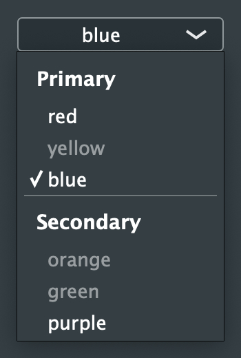
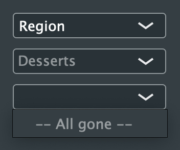
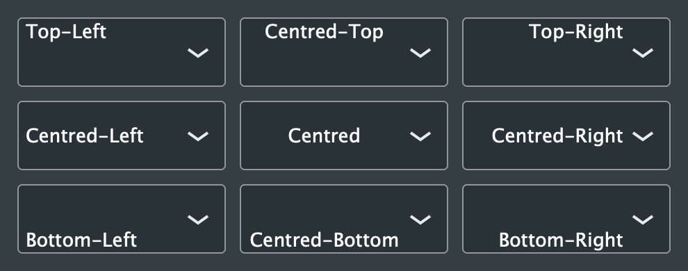

# Combo Box

| JIVE GUI Item | `jive::ComboBox` |
|---------------|------------------|
| JUCE Widget   | `juce::ComboBox` |
| Container?    | No               |

## Types

### `<ComboBox>`

| Property ID | Value | Default | Description |
|-------------|-------|---------|-------------|
| `text`      | String | ""      | The text displayed in the box. See [juce::ComboBox Class Reference](https://docs.juce.com/master/classComboBox.html#a2914dc2d3fd068d2e4ae4ccf03e42cfd) |
| `text-nothing-selected` | String | ""      | The text displayed when nothing's selected. See [juce::ComboBox Class Reference](https://docs.juce.com/master/classComboBox.html#aa06d9e5b0437bc1717c761e0b9df8be5) |
| `text-no-options` | String | "" | The text displayed in the box's drop-down menu when no other options are available. See [juce::ComboBox Class Reference](https://docs.juce.com/master/classComboBox.html#aac6093916748d66bb8e83373105c0e85) |
| `justification` | "top-left", "centred-top", "top-right", "centred-right", "bottom-right", "centred-bottom", "bottom-left", "centred-left", "centred" | "centred-left" | The justification for the text in the box. See [juce::ComboBox Class Reference](https://docs.juce.com/master/classComboBox.html#a90706d1526b2f53aba6a01dc2ccbba5f) |
| `editable`  | Boolean | `false` | Whether or not the box's text can be edited. See[juce::ComboBox Class Reference](https://docs.juce.com/master/classComboBox.html#af11edea3da851e2e0cb231f2cffa57aa) |

### `<Option>`

Must be a child of a `<ComboBox>` element.

| Property ID | Value | Default | Required? | Description |
|-------------|--------|---------|-----------|-------------|
| `text`      | Non-empty string | N/A     | Yes       | The option's text. pwrSee [juce::ComboBox Class Reference](https://docs.juce.com/master/classComboBox.html#a37491da45f1cbb74e47f145e5664d8bf) |
| `enabled`      | Boolean | `true`  | No        | Whether or not the option's enabled. See [juce::ComboBox Class Reference](https://docs.juce.com/master/classComboBox.html#ad2a408f7f2a4318f66b7a6ae566dfab2) |
| `selected`  | Boolean | `false` | No | Whether or not the option is selected. Only one option may be selected at a time. See [juce::ComboBox Class Reference](https://docs.juce.com/master/classComboBox.html#a61f8097b495703a253c33897e978fc06) |

### `<Header>`

Must be a child of a `<ComboBox>` element.

| Property ID | Value | Default | Required? | Description |
|-------------|--------|---------|-----------|-------------|
| `text`      | Non-empty string | ""      | Yes       | The header's text. See [juce::ComboBox Class Reference](https://docs.juce.com/master/classComboBox.html#ad376928ef517800c42628399e1a80990) |

### `<Separator>`

Must be a child of a `<ComboBox>` element.

See [juce::ComboBox Class Reference](https://docs.juce.com/master/classComboBox.html#af53bb419bb136f11f6f0342702d8d902).

## Examples

### Options, Headers, and Separators

```xml
<ComboBox justification="centred" width="150">
    <Header text="Primary"/>
    <Option text="red"/>
    <Option text="yellow" enabled="false"/>
    <Option text="blue" selected="true"/>

    <Separator/>

    <Header text="Secondary"/>
    <Option text="orange" enabled="false"/>
    <Option text="green" enabled="false"/>
    <Option text="purple"/>
</ComboBox>
```



### Text, Nothing Selected, No Options

```xml
<ComboBox text="Region" width="150">
    <Option text="Somewhere"/>
</ComboBox>

<ComboBox nothingSelectedText="Desserts" width="150">
    <Option text="Apple pie"/>
</ComboBox>

<ComboBox noOptionsText="-- Error --" width="150">
</ComboBox>
```



### Justification

```xml
<ComboBox text="Top-Left"       justification="top-left"       width="150" height="50"/>
<ComboBox text="Centred-Top"    justification="centred-top"    width="150" height="50"/>
<ComboBox text="Top-Right"      justification="top-right"      width="150" height="50"/>
<ComboBox text="Centred-Left"   justification="centred-left"   width="150" height="50"/>
<ComboBox text="Centred"        justification="centred"        width="150" height="50"/>
<ComboBox text="Centred-Right"  justification="centred-right"  width="150" height="50"/>
<ComboBox text="Bottom-Left"    justification="bottom-left"    width="150" height="50"/>
<ComboBox text="Centred-Bottom" justification="centred-bottom" width="150" height="50"/>
<ComboBox text="Bottom-Right"   justification="bottom-right"   width="150" height="50"/>
```


