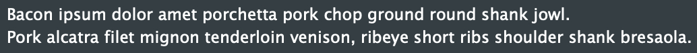
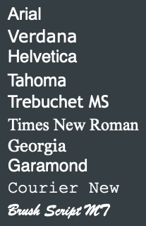

# Label

| JIVE GUI Item | `jive::Label` |
|---------------|---------------|
| JUCE Widget   | `juce::Label` |
| Container?    | No            |

## Types

### `<Label>`

| Property ID | Values | Default | Description |
|-------------|--------|---------|-------------|
| `text`      | Any string | ""      | The text displayed in the label. Can also be set with sub-text (see examples). See [juce::Label Class Reference](https://docs.juce.com/master/classLabel.html#a3f0ca22cb63e924d3db23da48c210790) |
| `justification` | "top-left", "centred-top", "top-right", "centred-right", "bottom-right", "centred-bottom", "bottom-left", "centred-left", "centred" | "centred-left" | The justification for the label's text. See [juce::Label Class Reference](https://docs.juce.com/master/classLabel.html#a9d857b984a1762b70424f4893efe99d2) |
| `typefaceName` | Any string | ""      | The name of the typeface for the label's font. See [juce::Label Class Reference](https://docs.juce.com/master/classLabel.html#af590df032e89790278b1b00ce4083d1d) and [juce::Font Class Reference](https://docs.juce.com/master/classFont.html#a79a3169e0685ade146aefe20b2250745) |
| `fontWeight` | Any string | "Regular" | The weight (AKA typeface style) for the label's font. See [juce::Label Class Reference](https://docs.juce.com/master/classLabel.html#af590df032e89790278b1b00ce4083d1d) and [juce::Font Class Reference](https://docs.juce.com/master/classFont.html#a844b7f87922aabf01971921f44d2662f) |
| `fontHeight` | Any number | 12      | The _point_ height for the label's font. This is different from just the font height, this is specifically the _point_ height of the font. See [juce::Label Class Reference](https://docs.juce.com/master/classLabel.html#af590df032e89790278b1b00ce4083d1d) and [juce::Font Class Reference](https://docs.juce.com/master/classFont.html#a2836004f680de86d7a793dec841e6fd5) |
| `fontStyle` | Space-separated list of any of the following: `plain`, `bold`, `underlined`, `italic` | "plain" | The style for the label's font. See [juce::Label Class Reference](https://docs.juce.com/master/classLabel.html#af590df032e89790278b1b00ce4083d1d) and [juce::Font Class Reference](https://docs.juce.com/master/classFont.html#a6e4e89d5c6b92af16360307ea8b0a905) |

## Examples

### Text

```xml
<Label>Bacon ipsum dolor amet porchetta pork chop ground round shank jowl.</Label>
<Label>Pork alcatra filet mignon tenderloin venison, ribeye short ribs shoulder shank bresaola.</Label>
```



### Fonts

```xml
<Label typefaceName="Arial">Arial</Label>
<Label typefaceName="Verdana">Verdana</Label>
<Label typefaceName="Helvetica">Helvetica</Label>
<Label typefaceName="Tahoma">Tahoma</Label>
<Label typefaceName="Trebuchet MS">Trebuchet MS</Label>
<Label typefaceName="Times New Roman">Times New Roman</Label>
<Label typefaceName="Georgia">Georgia</Label>
<Label typefaceName="Garamond">Garamond</Label>
<Label typefaceName="Courier New">Courier New</Label>
<Label typefaceName="Brush Script MT">Brush Script MT</Label>
```


